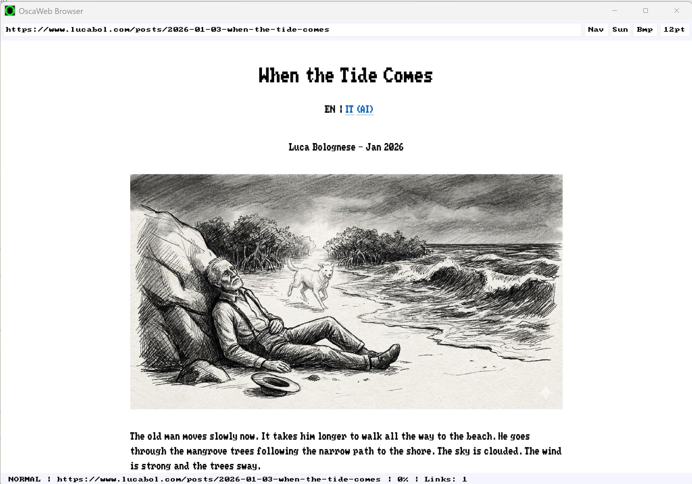
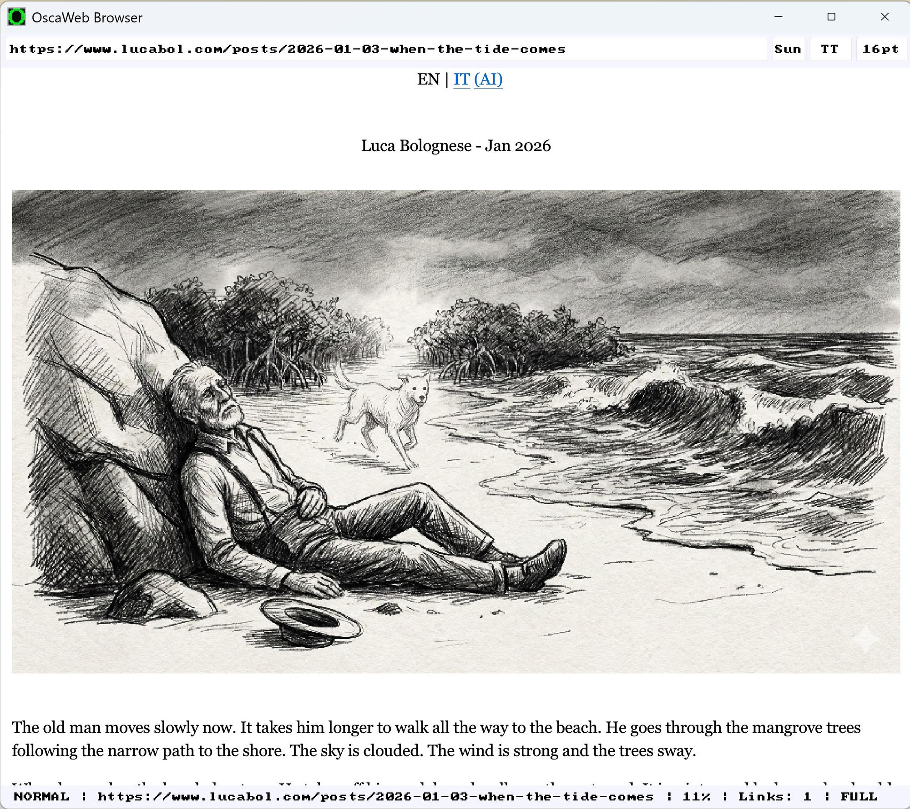

# OscaWeb

[](LICENSE)
[](https://github.com/lucabol/Oscan)
[]()

**A minimal, Vim-powered web browser written in [Oscan](https://github.com/lucabol/Oscan).**

OscaWeb is a Single Document Interface (SDI) web browser that prioritizes keyboard-driven navigation inspired by [Vimium](https://github.com/philc/vimium). It supports HTTP/HTTPS (TLS built into Oscan — SChannel on Windows, BearSSL on Linux), renders images inline (PNG, JPEG, BMP, GIF, SVG), and runs inline JavaScript via an embedded [QuickJS-ng](https://github.com/nicotordev/quickjs-ng) engine — all with zero external dependencies beyond the Oscan compiler.

## Table of Contents

- [Key Features](#key-features)
- [Screenshots](#screenshots)
- [Prerequisites](#prerequisites)
- [Quick Start](#quick-start)
- [Keyboard Shortcuts](#keyboard-shortcuts)
- [HTML Rendering](#html-rendering)
- [Image Pipeline](#image-pipeline)
- [JavaScript Engine](#javascript-engine)
- [Mouse Interaction](#mouse-interaction)
- [Link Hint Mode](#link-hint-mode)
- [Status Bar](#status-bar)
- [Architecture](#architecture)
- [CSS](#css)
- [Networking](#networking)
- [Testing](#testing)
- [Reader Mode, Bookmarks & Zoom](#reader-mode-bookmarks--zoom)
- [Limitations](#limitations)
- [Manual Test Plan](#manual-test-plan)
- [Design Philosophy](#design-philosophy)
- [Contributing](#contributing)
- [Built With](#built-with)
- [License](#license)

### Key Features

Ordered from coolest-first. Deeper detail under the linked sections.

- **Vim-style keyboard navigation** — scroll, follow links, search, and navigate without ever reaching for the mouse. [Keyboard Shortcuts](#keyboard-shortcuts).
- **Link hint mode** — press `f` and every link gets a 1–2 letter label; type the label to jump. `F` targets chrome-only links. [Link Hint Mode](#link-hint-mode).
- **Reader mode + chrome trimming + article column** — `<main>`/`<article>` auto-narrows to a readable column; sidebars, hamburger menus, and footers are hidden by default. `gr` toggles reader mode, `gR` shows the full page. [Reader Mode, Bookmarks & Zoom](#reader-mode-bookmarks--zoom).
- **Omnibox with DuckDuckGo + history autocomplete** — the address bar doubles as a search box; anything non-URL goes to DuckDuckGo. History substring matches auto-suggest as you type. [Omnibox & autocomplete](#omnibox--autocomplete).
- **Embedded JavaScript (QuickJS-ng)** — inline `<script>`, external `<script src>`, `onclick`, plus a real DOM API (`querySelector`, `classList`, …). [JavaScript Engine](#javascript-engine).
- **HTTP + HTTPS with zero external deps** — TLS is built into Oscan (SChannel on Windows, BearSSL on Linux). Chunked transfer-encoding and redirects included. [Networking](#networking).
- **Inline images** — PNG, JPEG, BMP, GIF, and SVG decoded, cached, and drawn inline. [Image Pipeline](#image-pipeline).
- **CSS with a real cascade** — inline `<style>`, external `<link rel="stylesheet">`, and inline `style=""` parsed with descendant/child combinators, attribute selectors, specificity, and inheritance. [CSS](#css).
- **Rich HTML rendering** — 30+ tags including tables (auto-sized columns), lists, blockquotes, and code blocks. [HTML Rendering](#html-rendering).
- **Form submission (GET + POST)** — `gf` fills `<form>` fields sequentially (text, textarea, checkbox, radio, select) and submits with URL-encoded bodies. [Browsing keys](#browsing).
- **Persistent HTTP cache** — 20-slot FIFO cache survives restarts; back/forward and repeat visits are instant. `r` to force a refetch. [Networking](#networking).
- **Cookie jar** — RFC 6265 subset with disk persistence. `gC` clears everything. [Networking](#networking).
- **Persistent history & bookmarks** — 500 most-recent URLs on disk; `b` to bookmark, `B` for the bookmarks panel. [History & bookmarks](#history--bookmarks).
- **Outline / table of contents** — `t` overlays H1–H3 headings; `1`–`9` jumps. [Outline / table of contents (`t`)](#outline--table-of-contents-t).
- **In-page search** — `/` to search, `n`/`N` to navigate matches.
- **Text selection & copy** — click-and-drag to select; released selections hit the clipboard automatically.
- **Fragment navigation** — `#anchor` scrolls to the element; same-page fragments skip the network.
- **Runtime zoom** — `+`/`-`/`0` between 1× and 4×.
- **Dark theme** — purpose-built color scheme for comfortable reading.
- **Minimal dependencies** — only the Oscan compiler is required to build.

## Screenshots

### Retro look — monospace bitmap font (default)

The default terminal-inspired theme uses an 8×8 bitmap font for that unmistakable DOS/VT100 feel.



### Modern look — TrueType font at larger sizes

Switch to a TrueType font (`TT`) and bump the size (`16pt`) for a clean, modern reading experience while keeping every Vim keybinding.



## Prerequisites

- **[Oscan compiler](https://github.com/lucabol/Oscan)** — required (includes TLS support)
- **PowerShell** — for the build script

## Quick Start

```powershell
# Build and run
.\build.ps1 -Run

# Navigate to a URL on startup
.\build\browser.exe http://example.com
```

Press `o` once the browser is running to open a URL, or pass one on the command line.

## Keyboard Shortcuts

OscaWeb uses Vimium-inspired keybindings. Press `?` in the browser to toggle the help overlay.

### Navigation

| Key     | Action              |
| ------- | ------------------- |
| `j`     | Scroll down         |
| `k`     | Scroll up           |
| `d`     | Half page down      |
| `u`     | Half page up        |
| `Space` | Full page down      |
| `gg`    | Scroll to top       |
| `G`     | Scroll to bottom    |

### Browsing

| Key   | Action                            |
| ----- | --------------------------------- |
| `f`   | Follow link (hint mode, all links)|
| `F`   | Follow link — chrome links only (nav/header/footer/aside) |
| `o`   | Open URL / search (clear bar)     |
| `O`   | Edit current URL                  |
| `r`   | Reload page                       |
| `gr`  | Toggle reader mode                |
| `gR`  | Toggle show-full (disable chrome trim + user stylesheet, reloads) |
| `gC`  | Clear all cookies (jar + disk file) |
| `gf`  | Fill form on the current page (sequential prompts, Enter advances, Esc aborts) |
| `gm`  | Jump to `<main>`/`<article>` / first heading |
| `t`   | Toggle outline (table of contents) |
| `b`   | Bookmark / un-bookmark current URL|
| `B`   | Toggle bookmarks panel            |
| `1`–`9` | Jump to Nth item (context: outline headings, or bookmarks when panel is open) |
| `p`   | Paste URL from clipboard and go   |
| `yy`  | Copy current URL to clipboard     |
| `H`   | Go back in history                |
| `L`   | Go forward in history             |

### Zoom

| Key   | Action              |
| ----- | ------------------- |
| `+` / `=` | Zoom in         |
| `-`   | Zoom out            |
| `0`   | Reset zoom          |

### Search

| Key   | Action              |
| ----- | ------------------- |
| `/`   | Search in page      |
| `n`   | Next match          |
| `N`   | Previous match      |

### Modes & Other

| Key      | Action                     |
| -------- | -------------------------- |
| `Esc`    | Return to normal mode      |
| `?`      | Toggle help overlay        |
| `Q`      | Quit browser               |
| `Ctrl+C` | Copy current URL           |
| `Ctrl+V` | Paste in address bar       |

### Address Bar Editing (Insert Mode)

| Key      | Action                                 |
| -------- | -------------------------------------- |
| `Ctrl+A` | Move cursor to start                   |
| `Ctrl+E` | Move cursor to end                     |
| `←` `→`  | Move cursor                            |
| `Down` / `Tab` | Cycle autocomplete suggestion ↓  |
| `Up`     | Cycle autocomplete suggestion ↑        |
| `Enter`  | Navigate to URL (or DuckDuckGo search) |
| `Esc`    | Cancel editing                         |

The address bar is also an omnibox: anything that does not look like a URL
(scheme, dot in the host, `localhost`, or `host:port`) is sent to
DuckDuckGo as a search query. Substring matches against your saved
browsing history appear as autocomplete suggestions while you type.

## HTML Rendering

OscaWeb renders 30+ HTML tags with a dark-themed color scheme:

**Text styling** — `<b>`/`<strong>`, `<em>`/`<i>`/`<cite>`, `<del>`/`<s>` (strikethrough), `<u>`/`<ins>` (underline), `<mark>` (highlight), `<code>`, `<pre>`

**Structure** — `<h1>`–`<h6>`, `<p>`, `<div>`, `<blockquote>` (indented with accent bar), `<hr>`, `<br>`, `<section>`, `<article>`, `<nav>`, `<header>`, `<footer>`, `<main>`, `<figure>`/`<figcaption>`

**Lists** — `<ul>` (bullets), `<ol>` (numbered), `<li>`, `<dl>`/`<dt>`/`<dd>` (definition lists)

**Tables** — `<table>`, `<thead>`/`<tbody>`/`<tfoot>`, `<tr>`, `<td>`/`<th>` with automatic column-width calculation, header separators, and cell truncation

**Links & images** — `<a>` (clickable, underlined, hint-followable), `` (fetched, decoded, cached, and scaled inline)

**Entities** — `&amp;`, `&lt;`, `&gt;`, `&mdash;`, `&ndash;`, `&hellip;`, `&copy;`, `&reg;`, `&trade;`, `&bull;`, `&larr;`, `&rarr;`, and more

## Image Pipeline

Images are fetched via HTTP/HTTPS, decoded, and rendered inline:

- **Formats** — PNG, JPEG, BMP, GIF (raster via `img_load()`), SVG (rasterized via `svg_load()`)
- **Caching** — decoded pixel data cached per page; cleared on navigation
- **Scaling** — images wider than 1000px are downscaled via nearest-neighbor at cache time
- **HTML attributes** — `width`/`height` supported (absolute pixels and percentages)
- **SVG compositing** — rendered over light gray background for icon visibility
- **Fallback** — `[IMG: alt text]` placeholder if decoding fails

## JavaScript Engine

OscaWeb embeds [QuickJS-ng](https://github.com/nicotordev/quickjs-ng) for JavaScript execution via a C bridge (`js_bridge.c`):

### What's supported

- **Inline scripts** — `<script>...</script>` blocks executed after page load
- **onclick handlers** — elements with `onclick` attributes are clickable; code evaluated on click
- **DOM dirty tracking** — JS modifications to the DOM trigger automatic re-render

### DOM API

```javascript
// Document methods
document.getElementById("myId")        // → Element or null
document.getElementsByTagName("div")   // → Element[]
document.getElementsByClassName("btn") // → Element[]
document.querySelector("#main .title") // → Element or null
document.querySelectorAll("a.ext")     // → Element[]

// Element properties
element.tagName       // getter
element.textContent   // getter/setter
element.children      // getter → child Element[]
element.id            // getter
element.className     // getter/setter (class attribute)
element.classList     // getter → DOMTokenList { add, remove, toggle, contains }

// Element methods
element.getAttribute("href")
element.setAttribute("class", "active")
element.querySelector(".note")           // scoped like document.querySelector
element.querySelectorAll("li")
element.addEventListener("click", fn)    // accepted, not dispatched
element.removeEventListener("click", fn) // accepted, not dispatched

// Console
console.log("hello")
console.warn("warning")
console.error("error")
```

**Selector subset supported by `querySelector`/`querySelectorAll`:** `tag`,
`.class`, `#id`, `*`, compound (`a.btn`, `div#main`), comma-separated lists,
and the descendant combinator (`nav a`, `#main .title`).

**External scripts** — `<script src="...">` is fetched (same origin rules
as `<link rel="stylesheet">`) and evaluated after inline scripts in
document order.

## Mouse Interaction

- **Click links** — click any link to navigate
- **Click onclick elements** — triggers JavaScript handler
- **Text selection** — click and drag to select text; released selection is automatically copied to clipboard
- **Address bar** — click to focus, click to reposition cursor within URL

## Link Hint Mode

Press `f` to enter Follow mode. Each link gets a hint label:

- **Single-letter** hints for pages with few links (`a`, `s`, `d`, `f`, ...)
- **Double-letter** hints for pages with many links (`aa`, `as`, `ad`, ...)
- Type the hint letters to navigate to the corresponding link
- If no labels match your typed prefix, Follow mode exits automatically

Press `F` (capital) to label only **chrome** links (nav/header/footer/aside) — useful for jumping to "edit", "talk", or site-nav items that are hidden by the default chrome trimming.

## Status Bar

The bottom bar shows at a glance:

- **Mode** — `NORMAL`, `INSERT`, `FOLLOW`, or `SEARCH`
- **Scroll position** — `Top` or percentage (e.g., `42%`)
- **Link count** — number of links on the current page
- **Search results** — `[2/5]` match counter when searching

## Architecture

OscaWeb is split into focused Oscan modules (`browser.osc`, `html.osc`,
`css.osc`, `http.osc`, `js.osc`, …) plus a single C bridge to QuickJS-ng.
For the module graph, per-module descriptions, and the on-disk file
layout, see [`docs/ARCHITECTURE.md`](docs/ARCHITECTURE.md).

## CSS

OscaWeb ships a small CSS engine (`css.osc`) that parses `<style>` blocks,
external `<link rel="stylesheet">` resources, and `style=""` attributes,
matches a simple selector subset against the DOM, runs the CSS 2.1
cascade, and propagates inheritable properties.

### Supported

- **Selectors** — `tag`, `.class`, `#id`, `*`, compounds (`h1.title`),
  comma-separated selector lists, the descendant combinator
  (`nav a`, `article .title`), the child combinator (`div > p`), and
  attribute selectors (`[attr]`, `[attr=value]`, `[attr~=tok]`,
  `[attr^=prefix]`, `[attr$=suffix]`, `[attr*=substr]`)
- **Properties** — `color`, `background-color` / `background`,
  `font-weight`, `font-style`, `text-decoration`
  (`underline` / `line-through` / `none`), `text-align`
  (`left` / `center` / `right`), `display: none`, `padding` (shorthand +
  T/R/B/L), `width` and `max-width` (px or %), `line-height` (unitless
  multiplier, px, or `normal`), and `margin: 0 auto` (sentinel for block
  centering; full margin box is not otherwise modelled)
- **Values** — named colors (subset), `#rgb`, `#rrggbb`, `rgb(r, g, b)`,
  `bold` / `normal` (and numeric weights), `italic`, `!important`
- **Cascade** — specificity + source order across inline `<style>` and
  external `<link rel="stylesheet">` blocks in document order; inline
  `style=""` wins over stylesheet rules; `!important` wins over
  non-`!important`
- **Inheritance** — `color`, `font-weight`, `font-style`,
  `text-decoration`, `text-align`, `line-height` propagate from parent
  to child
- **`@media`** — `prefers-color-scheme: dark` applies (OscaWeb is
  always-dark); `prefers-color-scheme: light` is dropped; all other
  at-rule preludes (`print`, `min-width`, …) are dropped

Because OscaWeb is a terminal-style renderer with a monospace bitmap
font, `font-weight: bold` and `font-style: italic` are approximated by
switching to the bold/italic accent color rather than changing glyph
shape. `text-align` is applied by measuring the inline text width of a
block and prepositioning the cursor before children render; it only
fires when the content fits on a single line (multi-line wrapping falls
back to left alignment).

### Not supported

- Sibling combinators (`+`/`~`) — rules containing them are parsed
  and skipped
- Pseudo-classes / pseudo-elements (`:hover`, `::before`, …)
- Box-model properties beyond `padding`/`width`/`max-width`/numeric
  `margin` (no `height`, `border`, `float`, `position`, `flex`, `grid`)
- Units other than unitless integers for `rgb()` and bare hex colors
- `@media` beyond `prefers-color-scheme` (other at-rules are parsed and
  ignored; `@import` and `@font-face` are not expanded)

### Try it

```powershell
# Serve the bundled smoke-test page, then open it in the browser
cd tests
python -m http.server 8000
# in another shell:
.\build\browser.exe http://localhost:8000/test_page_css.html
```

See `tests/test_page_css.html` for a compact page that exercises every
supported CSS feature.

## Networking

### HTTP/HTTPS

- **HTTP/1.1** with chunked `Transfer-Encoding` decoding, automatic
  `User-Agent: OscaWeb/0.1` header, and `Connection: close` (we still
  do one request per socket, but servers that don't send a
  `Content-Length` and instead stream chunked responses now work)
- **TLS built-in** — SChannel on Windows, BearSSL on Linux (zero external dependencies)
- **Redirects** — automatic follow of 301/302/307/308 (up to 5 hops)
- **Default ports** — 80 for HTTP, 443 for HTTPS
- **Persistent HTTP cache** — text responses (HTML, CSS, JS, JSON, XML)
  survive browser restarts; saved to
  `%APPDATA%/oscanweb_cache.txt` (or `$HOME/...` on POSIX) on exit and
  reloaded at startup. Binary resources (images) are cached in-memory
  only. Press `r` to invalidate the current URL and force a refetch.

### URL Handling

- Scheme detection (`http://`, `https://`, default `https`)
- Relative URL resolution (`../`, `./`, absolute paths, protocol-relative `//`)
- Query string and fragment (`#anchor`) preservation; fragment-only navigation skips the network
- Auto-prepends `https://` when no scheme is entered (matches modern browsers; many sites, e.g. `www.microsoft.com`, return 403 on plain HTTP)

## Testing

```powershell
# Run all unit tests (offline, CI-safe)
.\build.ps1 -Test

# Run individual test suites
oscan tests/test_url.osc --run
oscan tests/test_html.osc --run
```

### Real-world page regression suite

`tests/test_pages.osc` parses captured HTML fixtures from sites we've
previously hit rendering bugs on (HN, danluu.com, BMFW, RFC datatracker,
W3C CSS2 spec, Wikipedia) and asserts page-specific invariants — each
one corresponds to a fix we shipped. Run as part of `build.ps1 -Test`.

Refresh the captured snapshots when sites change layout:

```powershell
.\tools\capture_fixtures.ps1
```

### Live network smoke (manual)

```powershell
.\tools\smoke.ps1
```

Hits the public internet to verify the full HTTP→gzip→parse pipeline
end-to-end. Flaky by design; not part of CI. Use after touching
`http.osc`, `gzip_bridge.c`, or TLS-related code.

## Reader Mode, Bookmarks & Zoom

### Article column (default)

When a page contains a `<main>` or `<article>` element, OscaWeb narrows
that subtree to a readable ~640 CSS px and centers it (scales with the
current zoom level), so article pages don't run edge-to-edge on wide
canvases. Pages that already set their own `max-width` on the main
content are left alone, as are utility pages with no `<main>` or
`<article>` (homepages, search results, dashboards) — those keep the
full viewport width.

### Chrome trimming (default)

On heavy pages like Wikipedia, the hamburger menus, sidebars, language
lists, and footer chrome can dominate the viewport. By default OscaWeb:

1. Uses `<main>`/`<article>` as the render root when present, cutting
   site chrome at the tree level.
2. Applies a built-in user stylesheet that hides common chrome
   selectors (`nav`, `aside`, `.sidebar`, `.hamburger`, `#mw-panel`,
   `.vector-main-menu`, `.navbox`, etc.) with `!important`.
3. Skips `<form>`, `aria-hidden="true"`, and `hidden` attribute nodes
   while rendering.

Press `gR` to toggle **show-full** — this disables all three trimming
layers and reloads the page so you can see the original document.
The status bar shows `FULL` when this mode is active. Press `F` (capital)
for follow-mode hints on **chrome-only** links (useful to jump to
"edit", "talk", or site-nav items that were hidden).

### Outline / table of contents (`t`)

Press `t` to toggle an outline panel listing H1/H2/H3 headings in
document order. `1`–`9` jumps to the Nth heading. `gm` jumps straight
to the first heading (handy on pages that have no `<main>`).

### Reader mode (`gr`)

Toggles a distraction-free view on top of the article-column default.
If the page contains a `<main>` or `<article>` element, the renderer
uses that subtree as the document root. Otherwise, `<nav>`, `<header>`,
`<footer>`, `<aside>`, and `<form>` elements are hidden. The same
~640 CSS px column applies. Press `gr` again to return to the normal
view.

### Fragment navigation

Links to `#anchor` targets scroll the matching element to the top of the
viewport. When the only difference between the link target and the
current URL is the fragment, OscaWeb skips the network request entirely
and scrolls in-place.

### Omnibox & autocomplete

The address bar doubles as a search box. Press `o` and type:

- **URL-like input** (contains `://`, a dot in the host part, `localhost`,
  or `host:port`) → navigated directly
- **Anything else** → sent to DuckDuckGo as `https://duckduckgo.com/?q=...`

As you type, substring matches from your saved browsing history appear
below the address bar. `Down`/`Tab` and `Up` cycle through the
suggestions; `Enter` opens the highlighted one (or the literal text if
nothing is selected).

### History & bookmarks

- **History** is stored one URL per line in
  `%APPDATA%\oscaweb_history.txt` (or `$HOME/oscaweb_history.txt` on
  Linux), most-recent first, capped at 500 entries.
- **Bookmarks** live in `oscaweb_bookmarks.txt` next to the history file.
  Press `b` on any page to toggle it; `B` opens a panel listing all
  bookmarks; pressing `1`–`9` while the panel is open jumps to the
  matching entry.

### Zoom

`+` / `=` zooms in, `-` zooms out, `0` resets. The current zoom factor
is shown in the status bar. Zoom is clamped between 1× and 4× and scales
headings, paragraphs, code blocks, and tables uniformly.

## Limitations

- **No full CSS layout** — colors, weights, decorations, backgrounds,
  `display:none`, `padding`, `width`/`max-width` and numeric `margin`
  are honored, but there is no `height`, `border`, flexbox/grid, or
  `float`/`position`
- **CSS selectors** — `tag`, `.class`, `#id`, `*`, comma-separated lists,
  descendant combinator (` `), child combinator (`>`), and attribute
  selectors (`[attr]`, `[attr=v]`, `[attr~=v]`, `[attr^=v]`, `[attr$=v]`,
  `[attr*=v]`). Sibling combinators (`+`, `~`) and pseudo-classes
  (`:hover`, `::before`) are not matched
- **Limited form submission** — GET and POST forms supported via `gf` with text, textarea, checkbox, radio, and select fields (no visual inline rendering of the fields; prompting is status-bar-driven)
- **HTTP Content-Encoding: gzip / deflate** are decoded transparently
  via miniz (RFC 1952 gzip and RFC 1950 zlib).  Brotli and other
  encodings are not supported and produce a clear error rather than a
  hang.
- **Fixed viewport** — 1024×768 window with 8×8 monospace bitmap font
- **Single-threaded** — synchronous page fetching

## Manual Test Plan

End-to-end smoke-test recipes live in [`docs/MANUAL_TESTS.md`](docs/MANUAL_TESTS.md).
They cover chunked transfer-encoding, external `<script src>`,
checkbox/radio/select form flows, CSS attribute + child selectors, JS DOM
APIs, and the persistent HTTP cache.

## Design Philosophy

- **SDI (Single Document Interface)** — one window, no tabs, maximum simplicity
- **Keyboard-first** — Vim-inspired navigation means your hands never leave the home row
- **Oscan showcase** — demonstrates the language's ability to build real applications with C interop
- **Zero external dependencies** — only the Oscan compiler is needed; TLS, image decoding, and JS are all built in

## Contributing

1. Build & test before sending a change:

   ```powershell
   .\build.ps1 -Test
   ```

2. Match the existing Oscan style — see [`.github/copilot-instructions.md`](.github/copilot-instructions.md) if present, or the conventions documented throughout this README (no `arena { }` around `push()` on persistent arrays, in-place `while len(arr) > 0 { pop(arr); };` clearing, etc.).
3. Keep commits focused and include a short description of what and why.

## Built With

- **[Oscan](https://github.com/lucabol/Oscan)** — Minimalist language designed for LLM code generation, compiling to C99
- **[QuickJS-ng](https://github.com/nicotordev/quickjs-ng)** — Lightweight JavaScript engine (embedded via C bridge)
- **[Vimium](https://github.com/philc/vimium)** — Inspiration for the keyboard shortcut scheme

## License

This project is licensed under the [MIT License](LICENSE).
