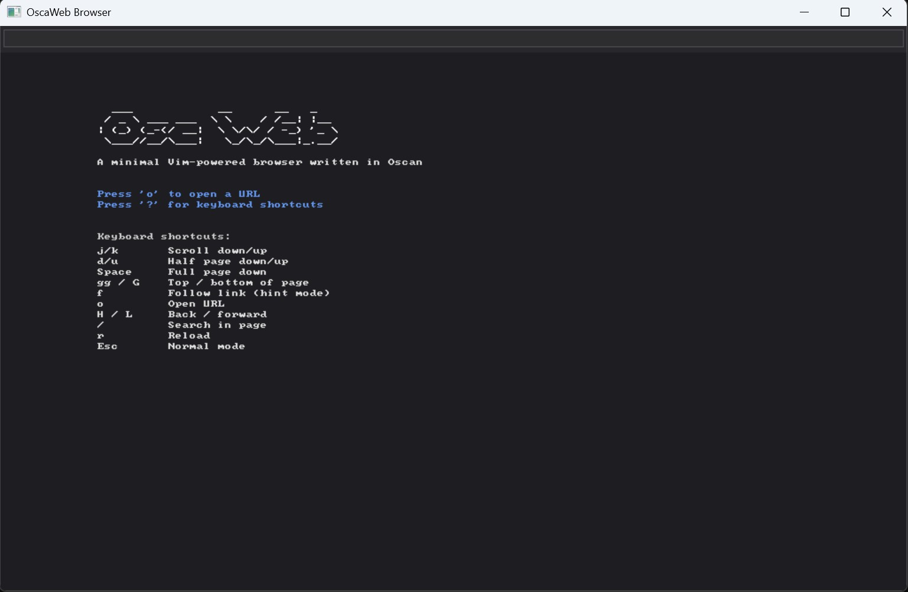

# OscaWeb

**A minimal, Vim-powered web browser written in [Oscan](https://github.com/lucabol/Oscan)**

OscaWeb is a Single Document Interface (SDI) web browser that prioritizes keyboard-driven navigation inspired by [Vimium](https://github.com/philc/vimium). It supports HTTP and HTTPS (TLS built into Oscan — SChannel on Windows, BearSSL on Linux), renders images inline (PNG, JPEG, BMP, GIF, SVG), and executes inline JavaScript via an embedded [QuickJS-ng](https://github.com/nicotordev/quickjs-ng) engine — all with zero external dependencies beyond the Oscan compiler.

### Key Features

- **Vim-like keyboard navigation** — scroll, follow links, search, and navigate entirely from the keyboard
- **HTTP page cache** — 20-entry FIFO cache keyed by URL; back/forward and repeat visits are instant. Bypassed on `r` (reload).
- **Cookie jar** — minimal RFC 6265 subset: `Set-Cookie` parsing (Max-Age, Expires, Secure, Domain, Path), `Cookie:` header injection on main-document fetches, persisted across restarts. Clear with `gC`.
- **Form submission (GET and POST)** — press `gf` to fill `<form>` text fields sequentially via status-bar prompts, then submit. Supports text, search, email, url, tel, password, number, and textarea inputs; submit buttons and hidden fields are included automatically. POST forms dispatch `application/x-www-form-urlencoded` bodies; redirects after a POST follow as GETs.
- **Omnibox search** — type any query in the address bar; non-URL input is sent to DuckDuckGo automatically, with autocomplete from your browsing history
- **Readable article column** — when a page has `<main>` or `<article>`, that subtree is automatically narrowed to ~640 CSS px and centered, so long articles don't run edge-to-edge on wide canvases
- **Chrome trimming** — navigation sidebars, hamburger menus, and site chrome (nav/header/footer/aside, `#mw-panel`, `.vector-*`, `.sidebar`, etc.) are hidden by default on heavy pages like Wikipedia; `gR` toggles the full page back on
- **Outline / table of contents** — `t` opens a heading overlay (H1–H3); `1`–`9` jumps to a section. `gm` jumps straight to the main content.
- **Reader mode** — `gr` strips navigation/header/footer/forms and renders the main content for distraction-free reading
- **Fragment navigation** — `#section` anchors scroll to the matching element; same-page fragment links skip the network round-trip
- **Persistent history & bookmarks** — history is saved to `%APPDATA%\oscaweb_history.txt` (500 entries); `b` bookmarks the current page, `B` opens the bookmarks panel, `1`–`9` jumps to a saved site
- **Runtime zoom** — `+`/`-` zoom in/out, `0` resets (1×–4×)
- **HTTP and HTTPS support** — TLS is built into Oscan (zero external dependencies)
- **JavaScript execution** — inline `<script>` tags and `onclick` handlers via embedded QuickJS-ng
- **Basic CSS styling** — inline `<style>` blocks, external `<link rel="stylesheet">` stylesheets, and inline `style=""` attributes are parsed and applied (color, background, font-weight, font-style, text-decoration, text-align, `display:none`, `padding`, `max-width`, `line-height`, `margin: 0 auto` centering, and `@media (prefers-color-scheme)`) with a real cascade, descendant combinator, and inheritance. Tables now auto-size columns to content and wrap long cells.
- **Image rendering** — PNG, JPEG, BMP, GIF, and SVG decoded, cached, and displayed inline
- **Rich HTML rendering** — headings, lists, tables, blockquotes, code blocks, and 30+ tags
- **Text selection & copy** — click-and-drag to select text, automatically copied to clipboard
- **In-page search** — `/` to search with match highlighting and `n`/`N` navigation
- **Dark theme** — purpose-built color scheme for comfortable reading
- **Minimal dependencies** — only the Oscan compiler is required to build

## Screenshot



## Prerequisites

- **[Oscan compiler](https://github.com/lucabol/Oscan)** — required (includes TLS support)
- **PowerShell** — for the build script

## Quick Start

```powershell
# Build and run
.\build.ps1 -Run

# Navigate to a URL on startup
build/browser.exe http://example.com
```

Press `o` once the browser is running to open a URL, or pass one on the command line.

## Keyboard Shortcuts

OscaWeb uses Vimium-inspired keybindings. Press `?` in the browser to toggle the help overlay.

### Navigation

| Key     | Action              |
| ------- | ------------------- |
| `j`     | Scroll down         |
| `k`     | Scroll up           |
| `d`     | Half page down      |
| `u`     | Half page up        |
| `Space` | Full page down      |
| `gg`    | Scroll to top       |
| `G`     | Scroll to bottom    |

### Browsing

| Key   | Action                            |
| ----- | --------------------------------- |
| `f`   | Follow link (hint mode, all links)|
| `F`   | Follow link — chrome links only (nav/header/footer/aside) |
| `o`   | Open URL / search (clear bar)     |
| `O`   | Edit current URL                  |
| `r`   | Reload page                       |
| `gr`  | Toggle reader mode                |
| `gR`  | Toggle show-full (disable chrome trim + user stylesheet, reloads) |
| `gC`  | Clear all cookies (jar + disk file) |
| `gf`  | Fill form on the current page (sequential prompts, Enter advances, Esc aborts) |
| `gm`  | Jump to `<main>`/`<article>` / first heading |
| `t`   | Toggle outline (table of contents) |
| `1`–`9` | Jump to Nth heading (when outline is open) |
| `b`   | Bookmark / un-bookmark current URL|
| `B`   | Toggle bookmarks panel            |
| `1`–`9` | Open Nth bookmark (when bookmarks panel is open) |
| `p`   | Paste URL from clipboard and go   |
| `yy`  | Copy current URL to clipboard     |
| `H`   | Go back in history                |
| `L`   | Go forward in history             |

### Zoom

| Key   | Action              |
| ----- | ------------------- |
| `+` / `=` | Zoom in         |
| `-`   | Zoom out            |
| `0`   | Reset zoom          |

### Search

| Key   | Action              |
| ----- | ------------------- |
| `/`   | Search in page      |
| `n`   | Next match          |
| `N`   | Previous match      |

### Modes & Other

| Key      | Action                     |
| -------- | -------------------------- |
| `Esc`    | Return to normal mode      |
| `?`      | Toggle help overlay        |
| `Q`      | Quit browser               |
| `Ctrl+C` | Copy current URL           |
| `Ctrl+V` | Paste in address bar       |

### Address Bar Editing (Insert Mode)

| Key      | Action                                 |
| -------- | -------------------------------------- |
| `Ctrl+A` | Move cursor to start                   |
| `Ctrl+E` | Move cursor to end                     |
| `←` `→`  | Move cursor                            |
| `Down` / `Tab` | Cycle autocomplete suggestion ↓  |
| `Up`     | Cycle autocomplete suggestion ↑        |
| `Enter`  | Navigate to URL (or DuckDuckGo search) |
| `Esc`    | Cancel editing                         |

The address bar is also an omnibox: anything that does not look like a URL
(scheme, dot in the host, `localhost`, or `host:port`) is sent to
DuckDuckGo as a search query. Substring matches against your saved
browsing history appear as autocomplete suggestions while you type.

## HTML Rendering

OscaWeb renders 30+ HTML tags with a dark-themed color scheme:

**Text styling** — `<b>`/`<strong>`, `<em>`/`<i>`/`<cite>`, `<del>`/`<s>` (strikethrough), `<u>`/`<ins>` (underline), `<mark>` (highlight), `<code>`, `<pre>`

**Structure** — `<h1>`–`<h6>`, `<p>`, `<div>`, `<blockquote>` (indented with accent bar), `<hr>`, `<br>`, `<section>`, `<article>`, `<nav>`, `<header>`, `<footer>`, `<main>`, `<figure>`/`<figcaption>`

**Lists** — `<ul>` (bullets), `<ol>` (numbered), `<li>`, `<dl>`/`<dt>`/`<dd>` (definition lists)

**Tables** — `<table>`, `<thead>`/`<tbody>`/`<tfoot>`, `<tr>`, `<td>`/`<th>` with automatic column-width calculation, header separators, and cell truncation

**Links & images** — `<a>` (clickable, underlined, hint-followable), `` (fetched, decoded, cached, and scaled inline)

**Entities** — `&amp;`, `&lt;`, `&gt;`, `&mdash;`, `&ndash;`, `&hellip;`, `&copy;`, `&reg;`, `&trade;`, `&bull;`, `&larr;`, `&rarr;`, and more

## Image Pipeline

Images are fetched via HTTP/HTTPS, decoded, and rendered inline:

- **Formats** — PNG, JPEG, BMP, GIF (raster via `img_load()`), SVG (rasterized via `svg_load()`)
- **Caching** — decoded pixel data cached per page; cleared on navigation
- **Scaling** — images wider than 1000px are downscaled via nearest-neighbor at cache time
- **HTML attributes** — `width`/`height` supported (absolute pixels and percentages)
- **SVG compositing** — rendered over light gray background for icon visibility
- **Fallback** — `[IMG: alt text]` placeholder if decoding fails

## JavaScript Engine

OscaWeb embeds [QuickJS-ng](https://github.com/nicotordev/quickjs-ng) for JavaScript execution via a C bridge (`js_bridge.c`):

### What's supported

- **Inline scripts** — `<script>...</script>` blocks executed after page load
- **onclick handlers** — elements with `onclick` attributes are clickable; code evaluated on click
- **DOM dirty tracking** — JS modifications to the DOM trigger automatic re-render

### DOM API

```javascript
// Document methods
document.getElementById("myId")        // → Element or null
document.getElementsByTagName("div")   // → Element[]

// Element properties
element.tagName       // getter
element.textContent   // getter/setter
element.children      // getter → child Element[]
element.id            // getter

// Element methods
element.getAttribute("href")
element.setAttribute("class", "active")

// Console
console.log("hello")
console.warn("warning")
console.error("error")
```

> **Note:** External scripts (`<script src="...">`) are not loaded. Only inline script content is executed.

## Mouse Interaction

- **Click links** — click any link to navigate
- **Click onclick elements** — triggers JavaScript handler
- **Text selection** — click and drag to select text; released selection is automatically copied to clipboard
- **Address bar** — click to focus, click to reposition cursor within URL

## Link Hint Mode

Press `f` to enter Follow mode. Each link gets a hint label:

- **Single-letter** hints for pages with few links (`a`, `s`, `d`, `f`, ...)
- **Double-letter** hints for pages with many links (`aa`, `as`, `ad`, ...)
- Type the hint letters to navigate to the corresponding link
- If no labels match your typed prefix, Follow mode exits automatically

## Status Bar

The bottom bar shows at a glance:

- **Mode** — `NORMAL`, `INSERT`, `FOLLOW`, or `SEARCH`
- **Scroll position** — `Top` or percentage (e.g., `42%`)
- **Link count** — number of links on the current page
- **Search results** — `[2/5]` match counter when searching

## Architecture

```
┌────────────┐     ┌──────────┐     ┌──────────┐
│ browser.osc│────▶│ http.osc │────▶│ url.osc  │
│ (UI, keys, │     │ (HTTP +  │     │ (parser) │
│  rendering)│     │  TLS)    │     └──────────┘
└────────────┘     └──────────┘
      │
      ├───────────▶┌──────────┐
      │            │ js.osc   │
      │            │ (JS FFI) │
      │            └──────────┘
      │                 │
      │            ┌──────────┐
      │            │js_bridge.c│
      │            │(QuickJS) │
      │            └──────────┘
      ▼
┌────────────┐     ┌──────────┐
│ html.osc   │     │libs/     │
│ (tokenizer │     │ ui.osc   │
│  + DOM)    │     │ (widgets)│
└────────────┘     └──────────┘
```

| Module           | Description |
| ---------------- | ----------- |
| `browser.osc`    | Main application — rendering engine, browser chrome, Vim keybindings, image pipeline, and page navigation |
| `url.osc`        | URL parsing (scheme, host, port, path, query, fragment) and relative URL resolution |
| `html.osc`       | State-machine-based HTML tokenizer and flat DOM tree builder |
| `css.osc`        | CSS tokenizer, parser, selector matcher, and cascade engine |
| `http.osc`       | HTTP/HTTPS client using Oscan's built-in TLS (`tls_connect`, `tls_send`, `tls_recv`) |
| `js.osc`         | JavaScript engine FFI — walks the DOM to execute inline `<script>` tags |
| `storage.osc`    | Flat-file persistence for history and bookmarks (APPDATA on Windows, HOME on Linux) |
| `js_bridge.c`    | C bridge exposing QuickJS-ng engine lifecycle, console, and DOM bindings to Oscan |
| `libs/ui.osc`    | Reusable UI widget library (panel, label, separator, button, checkbox, slider, textbox) |

## CSS

OscaWeb ships a small CSS engine (`css.osc`) that parses `<style>` blocks,
external `<link rel="stylesheet">` resources, and `style=""` attributes,
matches a simple selector subset against the DOM, runs the CSS 2.1
cascade, and propagates inheritable properties.

### Supported

- **Selectors** — `tag`, `.class`, `#id`, `*`, compounds (`h1.title`),
  comma-separated selector lists, and the descendant combinator
  (`nav a`, `article .title`)
- **Properties** — `color`, `background-color` / `background`,
  `font-weight`, `font-style`, `text-decoration`
  (`underline` / `line-through` / `none`), `text-align`
  (`left`/`center`/`right`), `display: none`
- **Values** — named colors (subset), `#rgb`, `#rrggbb`, `rgb(r, g, b)`,
  `bold`/`normal` (and numeric weights), `italic`, `!important`
- **Cascade** — specificity + source order across inline `<style>` and
  external `<link rel="stylesheet">` blocks in document order, inline
  `style=""` wins over stylesheet rules, `!important` wins over
  non-`!important`
- **Inheritance** — `color`, `font-weight`, `font-style`,
  `text-decoration`, `text-align` propagate from parent to child

Because OscaWeb is a terminal-style renderer with a monospace bitmap
font, `font-weight: bold` and `font-style: italic` are approximated by
switching to the bold/italic accent color rather than changing glyph
shape. `text-align` is applied by measuring the inline text width of a
block and prepositioning the cursor before children render; it only
fires when the content fits on a single line (multi-line wrapping falls
back to left alignment).

### Not supported

- Combinators other than descendant (child `>`, sibling `+`/`~`) —
  rules containing them are parsed and skipped
- Pseudo-classes / pseudo-elements (`:hover`, `::before`, …)
- Attribute selectors (`[href]`)
- Box-model properties (`width`, `height`, `margin`, `padding`, `border`,
  `float`, `position`, `flex`, `grid`)
- Units other than unitless integers for `rgb()` and bare hex colors
- `@media`, `@import`, `@font-face` and other at-rules (parsed and
  ignored)

### Try it

```powershell
# Serve the bundled smoke-test page, then open it in the browser
cd tests
python -m http.server 8000
# in another shell:
build/browser.exe http://localhost:8000/test_page_css.html
```

See `tests/test_page_css.html` for a compact page that exercises every
supported CSS feature.

## Networking

### HTTP/HTTPS

- **HTTP/1.0** with automatic `User-Agent: OscaWeb/0.1` header
- **TLS built-in** — SChannel on Windows, BearSSL on Linux (zero external dependencies)
- **Redirects** — automatic follow of 301/302/307/308 (up to 5 hops)
- **Default ports** — 80 for HTTP, 443 for HTTPS

### URL Handling

- Scheme detection (`http://`, `https://`, default `https`)
- Relative URL resolution (`../`, `./`, absolute paths, protocol-relative `//`)
- Query string and fragment (`#anchor`) preservation; fragment-only navigation skips the network
- Auto-prepends `https://` when no scheme is entered (matches modern browsers; many sites, e.g. `www.microsoft.com`, return 403 on plain HTTP)

## Testing

```powershell
# Run all tests
.\build.ps1 -Test

# Run individual test suites
oscan tests/test_url.osc --run
oscan tests/test_html.osc --run
```

## File Structure

```
oscanweb/
├── browser.osc          # Main application (rendering, chrome, vim keys, navigation)
├── url.osc              # URL parsing and resolution
├── http.osc             # HTTP/HTTPS client (built-in TLS)
├── html.osc             # HTML tokenizer and DOM builder
├── css.osc              # CSS tokenizer, parser, selector matcher, cascade
├── js.osc               # JavaScript engine FFI (QuickJS-ng)
├── storage.osc          # Flat-file persistence for history & bookmarks
├── js_bridge.c          # C bridge for QuickJS-ng DOM bindings
├── build.ps1            # Build script
├── README.md            # This file
├── requirements.md      # Original requirements
├── libs/
│   ├── ui.osc           # UI widget library (panel, button, checkbox, slider, textbox)
│   └── quickjs/         # QuickJS-ng engine source (quickjs.c, quickjs.h)
└── tests/
    ├── test_url.osc        # URL parser tests
    ├── test_html.osc       # HTML parser tests
    ├── test_css.osc        # CSS parser / cascade tests
    ├── test_render.osc     # Rendering tests
    ├── test_js.osc         # JavaScript engine tests
    ├── test_hints.osc      # Link hint label tests
    ├── test_page_css.html  # Manual CSS smoke-test page
    └── run_tests.ps1       # Test runner
```

## Reader Mode, Bookmarks & Zoom

### Article column (default)

When a page contains a `<main>` or `<article>` element, OscaWeb narrows
that subtree to a readable ~640 CSS px and centers it (scales with the
current zoom level), so article pages don't run edge-to-edge on wide
canvases. Pages that already set their own `max-width` on the main
content are left alone, as are utility pages with no `<main>` or
`<article>` (homepages, search results, dashboards) — those keep the
full viewport width.

### Chrome trimming (default)

On heavy pages like Wikipedia, the hamburger menus, sidebars, language
lists, and footer chrome can dominate the viewport. By default OscaWeb:

1. Uses `<main>`/`<article>` as the render root when present, cutting
   site chrome at the tree level.
2. Applies a built-in user stylesheet that hides common chrome
   selectors (`nav`, `aside`, `.sidebar`, `.hamburger`, `#mw-panel`,
   `.vector-main-menu`, `.navbox`, etc.) with `!important`.
3. Skips `<form>`, `aria-hidden="true"`, and `hidden` attribute nodes
   while rendering.

Press `gR` to toggle **show-full** — this disables all three trimming
layers and reloads the page so you can see the original document.
The status bar shows `FULL` when this mode is active. Press `F` (capital)
for follow-mode hints on **chrome-only** links (useful to jump to
"edit", "talk", or site-nav items that were hidden).

### Outline / table of contents (`t`)

Press `t` to toggle an outline panel listing H1/H2/H3 headings in
document order. `1`–`9` jumps to the Nth heading. `gm` jumps straight
to the first heading (handy on pages that have no `<main>`).

### Reader mode (`gr`)

Toggles a distraction-free view on top of the article-column default.
If the page contains a `<main>` or `<article>` element, the renderer
uses that subtree as the document root. Otherwise, `<nav>`, `<header>`,
`<footer>`, `<aside>`, and `<form>` elements are hidden. The same
~640 CSS px column applies. Press `gr` again to return to the normal
view.

### Fragment navigation

Links to `#anchor` targets scroll the matching element to the top of the
viewport. When the only difference between the link target and the
current URL is the fragment, OscaWeb skips the network request entirely
and scrolls in-place.

### Omnibox & autocomplete

The address bar doubles as a search box. Press `o` and type:

- **URL-like input** (contains `://`, a dot in the host part, `localhost`,
  or `host:port`) → navigated directly
- **Anything else** → sent to DuckDuckGo as `https://duckduckgo.com/?q=...`

As you type, substring matches from your saved browsing history appear
below the address bar. `Down`/`Tab` and `Up` cycle through the
suggestions; `Enter` opens the highlighted one (or the literal text if
nothing is selected).

### History & bookmarks

- **History** is stored one URL per line in
  `%APPDATA%\oscaweb_history.txt` (or `$HOME/oscaweb_history.txt` on
  Linux), most-recent first, capped at 500 entries.
- **Bookmarks** live in `oscaweb_bookmarks.txt` next to the history file.
  Press `b` on any page to toggle it; `B` opens a panel listing all
  bookmarks; pressing `1`–`9` while the panel is open jumps to the
  matching entry.

### Zoom

`+` / `=` zooms in, `-` zooms out, `0` resets. The current zoom factor
is shown in the status bar. Zoom is clamped between 1× and 4× and scales
headings, paragraphs, code blocks, and tables uniformly.

## Limitations

- **No CSS layout** — colors, weights, decorations, backgrounds, and
  `display:none` are honored, but there is no box model, no flexbox/grid,
  no floats, and no width/height/margin/padding rules
- **CSS selectors are simple only** — `tag`, `.class`, `#id`, `*`, and
  comma-separated lists; combinators (` `, `>`, `+`, `~`), pseudo-classes,
  attribute selectors, and `@media` queries are ignored
- **No external stylesheets** — `<link rel="stylesheet">` is not fetched
  (inline `<style>` blocks and `style=""` attributes are supported)
- **No external script loading** — `<script src="...">` tags are ignored
- **Limited form submission** — GET and POST forms supported via `gf` (no visual field rendering; no checkbox/radio/select UI yet)
- **Fixed viewport** — 1024×768 window with 8×8 monospace bitmap font
- **Single-threaded** — synchronous page fetching

## Design Philosophy

- **SDI (Single Document Interface)** — one window, no tabs, maximum simplicity
- **Keyboard-first** — Vim-inspired navigation means your hands never leave the home row
- **Oscan showcase** — demonstrates the language's ability to build real applications with C interop
- **Zero external dependencies** — only the Oscan compiler is needed; TLS, image decoding, and JS are all built in

## Built With

- **[Oscan](https://github.com/lucabol/Oscan)** — Minimalist language designed for LLM code generation, compiling to C99
- **[QuickJS-ng](https://github.com/nicotordev/quickjs-ng)** — Lightweight JavaScript engine (embedded via C bridge)
- **[Vimium](https://github.com/philc/vimium)** — Inspiration for the keyboard shortcut scheme

## License

This project is licensed under the MIT License.
