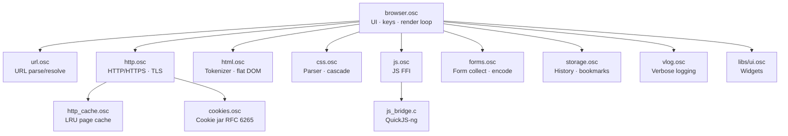

# OscaWeb — Architecture

This document describes the internal module layout of OscaWeb. For
user-facing features, keyboard shortcuts, and getting started, see the
main [README](../README.md).

## Module graph



## Modules

| Module           | Description |
| ---------------- | ----------- |
| `browser.osc`    | Main application — rendering engine, browser chrome, Vim keybindings, image pipeline, and page navigation |
| `url.osc`        | URL parsing (scheme, host, port, path, query, fragment) and relative URL resolution |
| `html.osc`       | State-machine-based HTML tokenizer and flat DOM tree builder |
| `css.osc`        | CSS tokenizer, parser, selector matcher, and cascade engine |
| `http.osc`       | HTTP/HTTPS client using Oscan's built-in TLS (`tls_connect`, `tls_send`, `tls_recv`) |
| `http_cache.osc` | In-memory FIFO page cache (20 slots) for text documents; persisted to disk on exit |
| `cookies.osc`    | Cookie jar — `Set-Cookie` parsing, `Cookie:` header injection, on-disk persistence |
| `forms.osc`      | Form collection, field encoding (`application/x-www-form-urlencoded`), successful-control rules |
| `js.osc`         | JavaScript engine FFI — walks the DOM to execute inline `<script>` tags |
| `storage.osc`    | Flat-file persistence for history and bookmarks (APPDATA on Windows, HOME on Linux) |
| `vlog.osc`       | Verbose diagnostic logging FFI (enabled with `--verbose`, appends to `browser.log`) |
| `js_bridge.c`    | C bridge exposing QuickJS-ng engine lifecycle, console, and DOM bindings to Oscan |
| `libs/ui.osc`    | Reusable UI widget library (panel, label, separator, button, checkbox, slider, textbox) |

## File structure

```
oscanweb/
├── browser.osc          # Main application (rendering, chrome, vim keys, navigation)
├── url.osc              # URL parsing and resolution
├── http.osc             # HTTP/HTTPS client (built-in TLS)
├── http_cache.osc       # FIFO page cache (20 slots) with disk persistence
├── cookies.osc          # Cookie jar (Set-Cookie / Cookie: / disk persistence)
├── forms.osc            # Form collection + URL-encoding
├── html.osc             # HTML tokenizer and DOM builder
├── css.osc              # CSS tokenizer, parser, selector matcher, cascade
├── js.osc               # JavaScript engine FFI (QuickJS-ng)
├── storage.osc          # Flat-file persistence for history & bookmarks
├── vlog.osc             # Verbose diagnostic logging FFI
├── js_bridge.c          # C bridge for QuickJS-ng DOM bindings
├── build.ps1            # Build script
├── README.md            # User-facing docs
├── LICENSE              # MIT license
├── requirements.md      # Original requirements
├── docs/
│   ├── ARCHITECTURE.md  # This file
│   └── MANUAL_TESTS.md  # End-to-end smoke-test recipes
├── libs/
│   ├── ui.osc           # UI widget library (panel, button, checkbox, slider, textbox)
│   └── quickjs/         # QuickJS-ng engine source (quickjs.c, quickjs.h)
└── tests/
    ├── test_url.osc        # URL parser tests
    ├── test_html.osc       # HTML parser tests
    ├── test_css.osc        # CSS parser / cascade tests
    ├── test_http.osc       # HTTP client tests
    ├── test_http_cache.osc # HTTP cache tests
    ├── test_cookies.osc    # Cookie jar tests
    ├── test_forms.osc      # Form encoding tests
    ├── test_render.osc     # Rendering tests
    ├── test_js.osc         # JavaScript engine tests
    ├── test_hints.osc      # Link hint label tests
    ├── test_page_css.html  # Manual CSS smoke-test page
    └── run_tests.ps1       # Test runner
```
